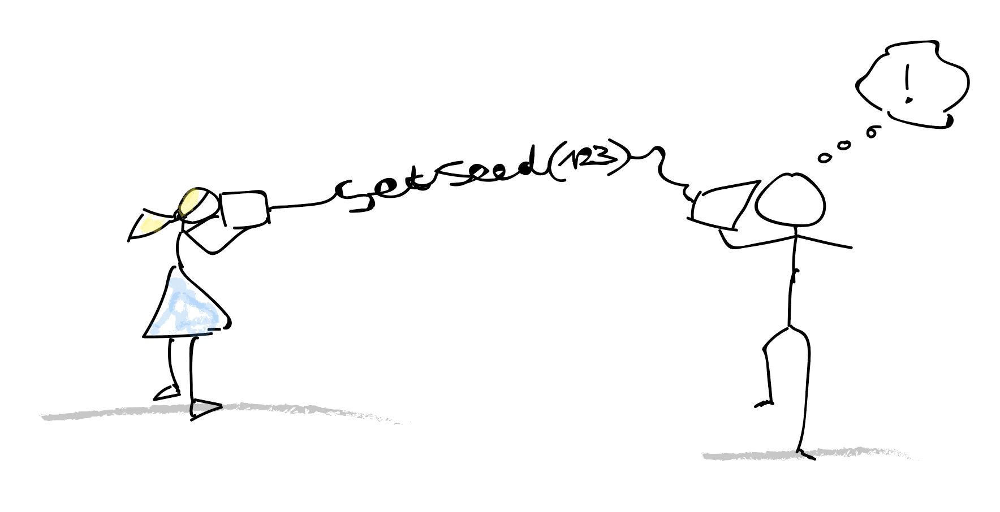
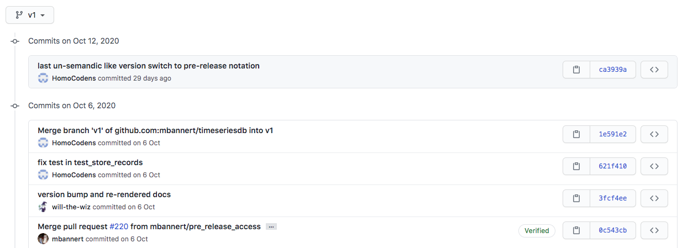
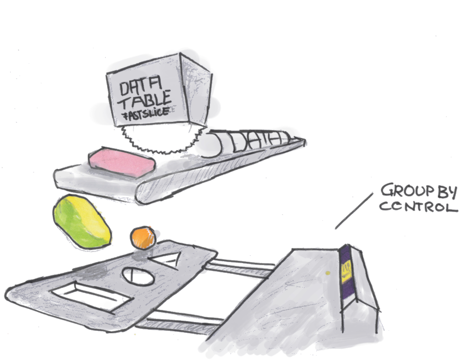

class:center,middle

## Should I Learn to Code in the Nearby Future?

"Hacking (Social Media) Data" by Dr. Matthias Bannert is licensed under <a href="https://creativecommons.org/licenses/by-nc-sa/4.0/?ref=chooser-v1">CC BY-NC-SA 4.0</a>

 

---

class:center,middle

## Don't click and point. Code.

"Hacking (Social Media) Data" by Dr. Matthias Bannert is licensed under <a href="https://creativecommons.org/licenses/by-nc-sa/4.0/?ref=chooser-v1">CC BY-NC-SA 4.0</a>

 

---

class:center,middle

# Why ?

"Hacking (Social Media) Data" by Dr. Matthias Bannert is licensed under <a href="https://creativecommons.org/licenses/by-nc-sa/4.0/?ref=chooser-v1">CC BY-NC-SA 4.0</a>

 

---

class:center,middle

## Data Visualization & Analysis

"Hacking (Social Media) Data" by Dr. Matthias Bannert is licensed under <a href="https://creativecommons.org/licenses/by-nc-sa/4.0/?ref=chooser-v1">CC BY-NC-SA 4.0</a>

 

---

## Try to Do this With Spreadsheet Software Pt. I

"Hacking (Social Media) Data" by Dr. Matthias Bannert is licensed under <a href="https://creativecommons.org/licenses/by-nc-sa/4.0/?ref=chooser-v1">CC BY-NC-SA 4.0</a>

 

---

## Try to Do this With Spreadsheet Software Pt. II

<iframe width="800" height="450" src="emoji.html"></iframe>
source: [Oversable HQ Twitter Emoji Race ](https://observablehq.com/@mbostock/twitter-emoji-race)

"Hacking (Social Media) Data" by Dr. Matthias Bannert is licensed under <a href="https://creativecommons.org/licenses/by-nc-sa/4.0/?ref=chooser-v1">CC BY-NC-SA 4.0</a>

 

---

## Try to Do this With Spreadsheet Software Pt. III

"Hacking (Social Media) Data" by Dr. Matthias Bannert is licensed under <a href="https://creativecommons.org/licenses/by-nc-sa/4.0/?ref=chooser-v1">CC BY-NC-SA 4.0</a>

 

---

class:center,middle

# Code as a Communication Channel

"Hacking (Social Media) Data" by Dr. Matthias Bannert is licensed under <a href="https://creativecommons.org/licenses/by-nc-sa/4.0/?ref=chooser-v1">CC BY-NC-SA 4.0</a>

 

---

## Code as a Communication Channel 

"Hacking (Social Media) Data" by Dr. Matthias Bannert is licensed under <a href="https://creativecommons.org/licenses/by-nc-sa/4.0/?ref=chooser-v1">CC BY-NC-SA 4.0</a>

 

---

## Reproducible Research

.pull-left[

]

.pull-right[
  
  

  
]

"Hacking (Social Media) Data" by Dr. Matthias Bannert is licensed under <a href="https://creativecommons.org/licenses/by-nc-sa/4.0/?ref=chooser-v1">CC BY-NC-SA 4.0</a>

 

---

class:center,middle

# Automation & Scaling

"Hacking (Social Media) Data" by Dr. Matthias Bannert is licensed under <a href="https://creativecommons.org/licenses/by-nc-sa/4.0/?ref=chooser-v1">CC BY-NC-SA 4.0</a>

 

---

class:center,middle

# 700 000 000+

(number of tweets per day)

"Hacking (Social Media) Data" by Dr. Matthias Bannert is licensed under <a href="https://creativecommons.org/licenses/by-nc-sa/4.0/?ref=chooser-v1">CC BY-NC-SA 4.0</a>

 

---

class:center,middle

# Where to Start?

"Hacking (Social Media) Data" by Dr. Matthias Bannert is licensed under <a href="https://creativecommons.org/licenses/by-nc-sa/4.0/?ref=chooser-v1">CC BY-NC-SA 4.0</a>

 

---

class:center,middle

Not wizardry. Carpentry.

"Hacking (Social Media) Data" by Dr. Matthias Bannert is licensed under <a href="https://creativecommons.org/licenses/by-nc-sa/4.0/?ref=chooser-v1">CC BY-NC-SA 4.0</a>

 

---

class:center,middle

## The Choice that Doesn't Matter

"Hacking (Social Media) Data" by Dr. Matthias Bannert is licensed under <a href="https://creativecommons.org/licenses/by-nc-sa/4.0/?ref=chooser-v1">CC BY-NC-SA 4.0</a>

 

--- 

## two languages slide

--- 

## Survey

---

## Survey Analysis

--- 

## Resources

