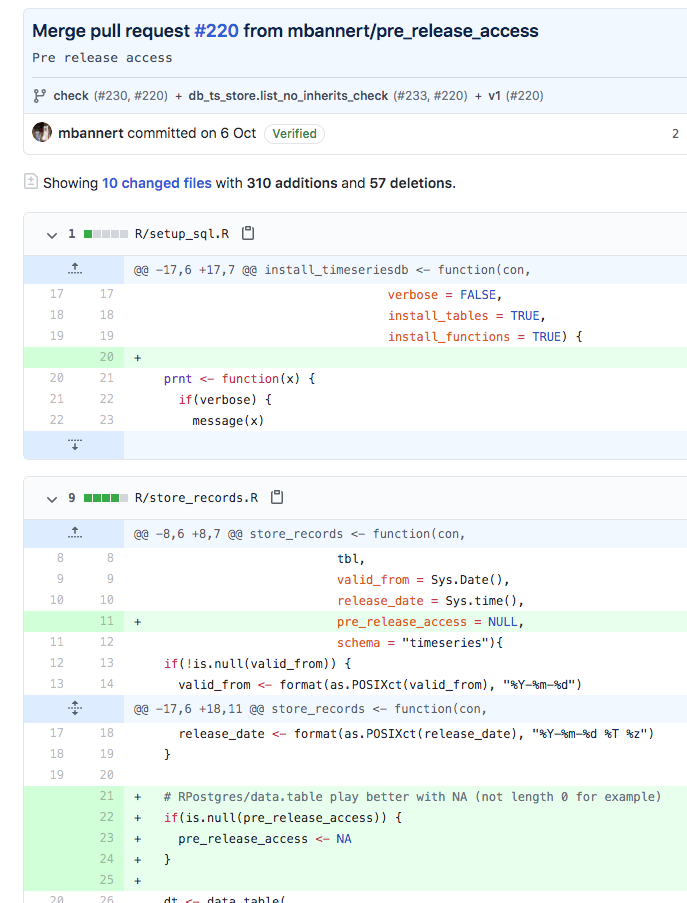

class:center,middle

## Should I Learn to Code in the Nearby Future?

<div class="my-footer"><span><div class="footer-text" align="right">"Hacking (Social Media) Data" by Dr. Matthias Bannert is licensed under <a href="https://creativecommons.org/licenses/by-nc-sa/4.0/?ref=chooser-v1">CC BY-NC-SA 4.0</a></div></span></div> 


---


class:center,middle

## Don't click and point. Code.

<div class="my-footer"><span><div class="footer-text" align="right">"Hacking (Social Media) Data" by Dr. Matthias Bannert is licensed under <a href="https://creativecommons.org/licenses/by-nc-sa/4.0/?ref=chooser-v1">CC BY-NC-SA 4.0</a></div></span></div> 


---


class:center,middle

# Why ?

<div class="my-footer"><span><div class="footer-text" align="right">"Hacking (Social Media) Data" by Dr. Matthias Bannert is licensed under <a href="https://creativecommons.org/licenses/by-nc-sa/4.0/?ref=chooser-v1">CC BY-NC-SA 4.0</a></div></span></div> 


---


class:center,middle

## Data Visualization & Analysis

<div class="my-footer"><span><div class="footer-text" align="right">"Hacking (Social Media) Data" by Dr. Matthias Bannert is licensed under <a href="https://creativecommons.org/licenses/by-nc-sa/4.0/?ref=chooser-v1">CC BY-NC-SA 4.0</a></div></span></div> 


---

## Try to Do this With Spreadsheet Software Pt. I


<a href="https://twitter.com/karim_douieb/status/1181934417650040832"></a>


<div class="my-footer"><span><div class="footer-text" align="right">"Hacking (Social Media) Data" by Dr. Matthias Bannert is licensed under <a href="https://creativecommons.org/licenses/by-nc-sa/4.0/?ref=chooser-v1">CC BY-NC-SA 4.0</a></div></span></div> 


---

## Try to Do this With Spreadsheet Software Pt. II


<iframe width="800" height="450" src="emoji.html"></iframe>
source: [Oversable HQ Twitter Emoji Race ](https://observablehq.com/@mbostock/twitter-emoji-race)


<div class="my-footer"><span><div class="footer-text" align="right">"Hacking (Social Media) Data" by Dr. Matthias Bannert is licensed under <a href="https://creativecommons.org/licenses/by-nc-sa/4.0/?ref=chooser-v1">CC BY-NC-SA 4.0</a></div></span></div> 


---


## Try to Do this With Spreadsheet Software Pt. III


<a href="https://twitter.com/bourdakos1/status/1125436388026060801"></a>

<div class="my-footer"><span><div class="footer-text" align="right">"Hacking (Social Media) Data" by Dr. Matthias Bannert is licensed under <a href="https://creativecommons.org/licenses/by-nc-sa/4.0/?ref=chooser-v1">CC BY-NC-SA 4.0</a></div></span></div> 


---


class:center,middle

# Code as a Communication Channel


<div class="my-footer"><span><div class="footer-text" align="right">"Hacking (Social Media) Data" by Dr. Matthias Bannert is licensed under <a href="https://creativecommons.org/licenses/by-nc-sa/4.0/?ref=chooser-v1">CC BY-NC-SA 4.0</a></div></span></div> 


---


## Code as a Communication Channel 


<a href="https://github.com/mbannert/tstools/issues/270"></a>

<div class="my-footer"><span><div class="footer-text" align="right">"Hacking (Social Media) Data" by Dr. Matthias Bannert is licensed under <a href="https://creativecommons.org/licenses/by-nc-sa/4.0/?ref=chooser-v1">CC BY-NC-SA 4.0</a></div></span></div> 


---


## Reproducible Research


.pull-left[

<a href="https://github.com/mbannert/timeseriesdb/commits/v1"></a>

]

.pull-right[
  
  <a href="https://github.com/mbannert/timeseriesdb/commit/0c543cbe302178f5d26b2ea45778fec0610c9da4"></a>

  
]


<div class="my-footer"><span><div class="footer-text" align="right">"Hacking (Social Media) Data" by Dr. Matthias Bannert is licensed under <a href="https://creativecommons.org/licenses/by-nc-sa/4.0/?ref=chooser-v1">CC BY-NC-SA 4.0</a></div></span></div> 


---


class:center,middle

# Automation & Scaling


<div class="my-footer"><span><div class="footer-text" align="right">"Hacking (Social Media) Data" by Dr. Matthias Bannert is licensed under <a href="https://creativecommons.org/licenses/by-nc-sa/4.0/?ref=chooser-v1">CC BY-NC-SA 4.0</a></div></span></div> 


---


class:center,middle

# 700 000 000+

(number of tweets per day)

<div class="my-footer"><span><div class="footer-text" align="right">"Hacking (Social Media) Data" by Dr. Matthias Bannert is licensed under <a href="https://creativecommons.org/licenses/by-nc-sa/4.0/?ref=chooser-v1">CC BY-NC-SA 4.0</a></div></span></div> 


---


class:center,middle

# Where to Start?


<div class="my-footer"><span><div class="footer-text" align="right">"Hacking (Social Media) Data" by Dr. Matthias Bannert is licensed under <a href="https://creativecommons.org/licenses/by-nc-sa/4.0/?ref=chooser-v1">CC BY-NC-SA 4.0</a></div></span></div> 


---

class:center,middle


Not wizardry. Carpentry.

<

<div class="my-footer"><span><div class="footer-text" align="right">"Hacking (Social Media) Data" by Dr. Matthias Bannert is licensed under <a href="https://creativecommons.org/licenses/by-nc-sa/4.0/?ref=chooser-v1">CC BY-NC-SA 4.0</a></div></span></div> 


---


class:center,middle

## The Choice that Doesn't Matter

<a href="https://h4sci.github.io/h4sci-book/introduction-the-choice-that-doesnt-matter.html"></a>


<div class="my-footer"><span><div class="footer-text" align="right">"Hacking (Social Media) Data" by Dr. Matthias Bannert is licensed under <a href="https://creativecommons.org/licenses/by-nc-sa/4.0/?ref=chooser-v1">CC BY-NC-SA 4.0</a></div></span></div> 


---


## Most Popular Scripting Languages in Data Science

.pull-left[


- [R Language for Statistical Computing](https://r-project.org)
- [Stackoverflow questions](https://stackoverflow.com/questions/tagged/r): 300K+
- Recommended Editor: [R Studio IDE](https://rstudio.com/products/rstudio/)
- Extensions
  - [CRAN](https://cran.r-project.org/) Repository /w ~15K Extension packages
  - [Shiny Web Framework](http://shiny.rstudio.com/)
- Trend: from Domain Specific to General Purpose
- Biggest Conference: useR! 

]

.pull-right[


- Python [2](https://www.python.org/downloads/release/python-272/) & [3](https://www.python.org/)
- [Stackoverflow questions](https://stackoverflow.com/questions/tagged/python): ~1.3M+
- Recommended Editor: [Visual Studio Code /w Jupyter Notebooks](https://code.visualstudio.com/docs/python/jupyter-support)
- Extensions
  - [anaconda](https://www.anaconda.com/)
  - [pandas](https://pandas.pydata.org/)
  - [numpy](https://numpy.org/)
  - [sciPy](https://www.scipy.org/)
- Most Popular Language in Deep Learning and Machine Learning
- Trend: General Purpose /w Scientific Extensions

]


<div class="my-footer"><span><div class="footer-text" align="right">"Hacking (Social Media) Data" by Dr. Matthias Bannert is licensed under <a href="https://creativecommons.org/licenses/by-nc-sa/4.0/?ref=chooser-v1">CC BY-NC-SA 4.0</a></div></span></div> 

---


class:center,middle

## A DIY Example of Social Media Analysis


---


## Social Media: Ruthless and Clueless at Times ...


1. Use {rtweet} API wrapper R package to obain ~30K tweets containing *Nate Silver*

2. Run text quantification methods, sentiment analysis

3. See how the perception of Nate Silver changed within days


---


class:center,middle


## <a href="https://h4sci.shinyapps.io/hsm">Survey</a>


<div class="my-footer"><span><div class="footer-text" align="right">"Hacking (Social Media) Data" by Dr. Matthias Bannert is licensed under <a href="https://creativecommons.org/licenses/by-nc-sa/4.0/?ref=chooser-v1">CC BY-NC-SA 4.0</a></div></span></div> 


```{r,echo=FALSE,warning=FALSE,message=FALSE}
library(ggplot2)
library(data.table)
library(RPostgres)
library(quanteda)

preprocess <- function(df, pattern){
  pattern_id <- paste0("id|group|",pattern)
  subs <- df[,grepl(pattern_id, names(df))]
  names(subs) <- gsub(pattern,"",names(subs))
  dt <- as.data.table(subs)
  m <- melt(dt, id.vars = "id")
  m
}

fcon <- file("../hsm/.pgpass","r")
    con <-  dbConnect(drv = Postgres(), dbname = "postgres", user = "postgres",
                       host = "34.65.173.162",
                      password = readLines(fcon, warn = FALSE))
o <- dbExecute(con,"SET SEARCH_PATH=h4sci")

res <- dbGetQuery(con,"SELECT * FROM hsm")

dbDisconnect(con)

```


---

## Survey Results: General

```{r, echo=FALSE}

words <- gsub(" vs. |,,", ",",paste(res$general,collapse = ","))

quanteda::textplot_wordcloud(dfm(words,remove = ","),
                             color = rev(viridis::viridis_pal()(6)),
                             min_count = 1)


```

<div class="my-footer"><span><div class="footer-text" align="right">"Hacking (Social Media) Data" by Dr. Matthias Bannert is licensed under <a href="https://creativecommons.org/licenses/by-nc-sa/4.0/?ref=chooser-v1">CC BY-NC-SA 4.0</a></div></span></div> 


---


## Survey Results: Languages

```{r, echo=FALSE, fig.width=14}

lang <- preprocess(res, "l_")
gg_lang <- ggplot(data = lang)
gg_lang +
  geom_bar(aes(x = as.factor(value), fill = variable)) +
  facet_wrap("variable", nrow = 2) + 
  theme_minimal() +
  theme(panel.grid.major.x = element_blank(),
        panel.spacing = unit(4, "lines"),
        text = element_text(size=15)) +
  scale_x_discrete(name ="Language",
                   limits=factor(1:5)) +
  scale_fill_viridis_d()


```


<div class="my-footer"><span><div class="footer-text" align="right">"Hacking (Social Media) Data" by Dr. Matthias Bannert is licensed under <a href="https://creativecommons.org/licenses/by-nc-sa/4.0/?ref=chooser-v1">CC BY-NC-SA 4.0</a></div></span></div> 


---


## Survey Results: Workflow

```{r, echo=FALSE, fig.width=14}

wf <- preprocess(res, "w_")
gg_lang <- ggplot(data = wf)
gg_lang +
  geom_bar(aes(x = as.factor(value), fill = variable)) +
  facet_wrap("variable", nrow = 1) +
  theme_minimal() +
  theme(panel.grid.major.x = element_blank(),
        panel.spacing = unit(4, "lines"),
        text = element_text(size=15)) +
  scale_x_discrete(name ="Language",
                   limits=factor(1:5)) +
  scale_fill_viridis_d()


```

<div class="my-footer"><span><div class="footer-text" align="right">"Hacking (Social Media) Data" by Dr. Matthias Bannert is licensed under <a href="https://creativecommons.org/licenses/by-nc-sa/4.0/?ref=chooser-v1">CC BY-NC-SA 4.0</a></div></span></div> 


---


## Survey Results: Learn to Code ? 


```{r, echo=FALSE, fig.width=14}

learn <- data.table(answer = res$learntocode)
by_group <- learn[, .(count = .N), by = answer]

gg_learn <- ggplot(data = learn,
                   aes(x = answer, fill = answer))


gg_learn +
  geom_bar() +
  theme_minimal() +
  theme(panel.grid.major.x = element_blank(),
        panel.spacing = unit(4, "lines"),
        text = element_text(size=15)) +
  scale_y_discrete(name ="Count",
                   limits = factor(1:(max(by_group$count)+2))) +
  scale_fill_viridis_d()


```


---


## Resources

- Free Online Book [Hacking for Social Sciences](https://h4sci.github.io/h4sci-book/)
- [Hacking (Social Media) Data Slides](https://h4sci.github.io/h4sci-socialmedia/)
- [Hacking (Social Media) Data Source Code](https://h4sci.github.io/h4sci-socialmedia/)


<div class="my-footer"><span><div class="footer-text" align="right">"Hacking (Social Media) Data" by Dr. Matthias Bannert is licensed under <a href="https://creativecommons.org/licenses/by-nc-sa/4.0/?ref=chooser-v1">CC BY-NC-SA 4.0</a></div></span></div> 


